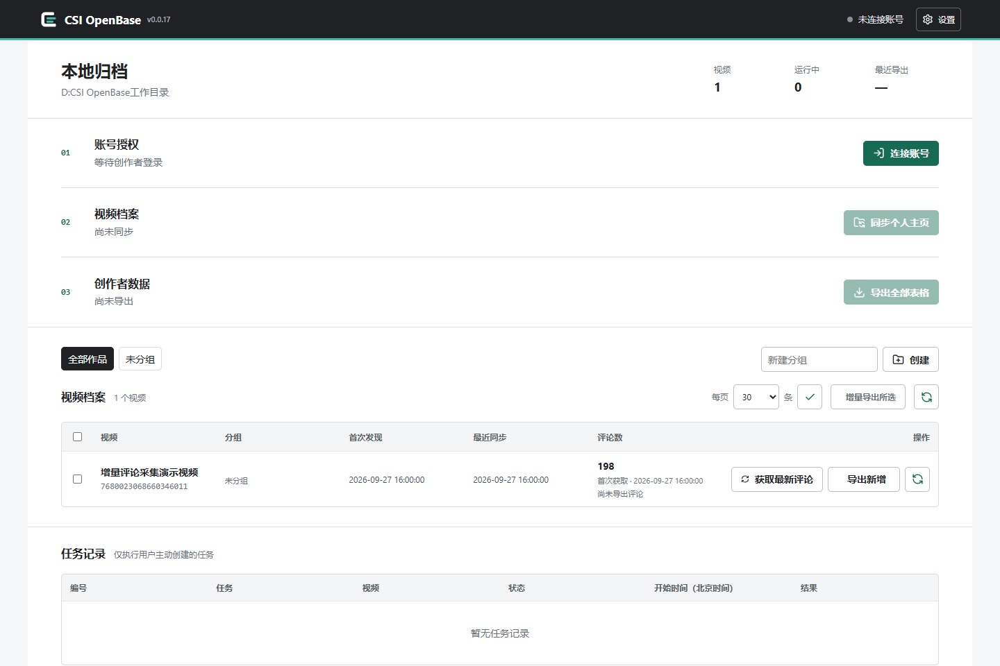
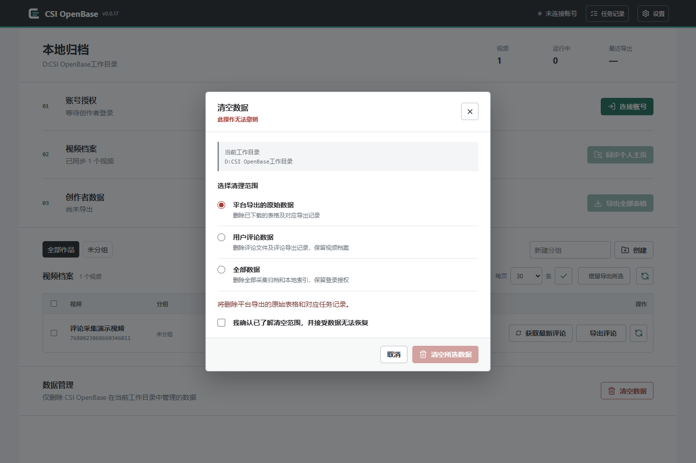
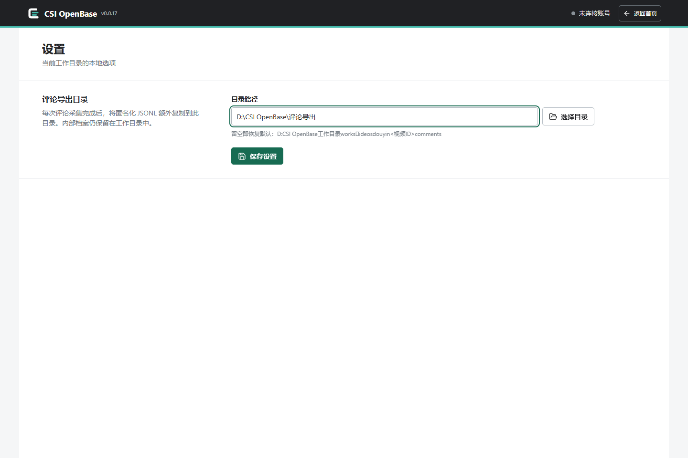

# CSI OpenBase WinForms

<p align="center">
  
</p>

<p align="center">
  <a href="README.md">English</a> | <strong>简体中文</strong>
</p>

本项目是 CSI OpenBase 的 Windows Forms 与 WebView2 桌面宿主，负责 Windows
界面、桌面设置、后端进程生命周期、便携版和安装程序。创作者授权、数据采集、归档和
本地 Web 界面由独立版本管理的 `csi-openbase` Python 包提供。

正式仓库：[CSI-OpenBase/winform](https://github.com/CSI-OpenBase/winform)

SSH 克隆地址：`git@github.com:CSI-OpenBase/winform.git`

Python 后端单独维护在
[CSI-OpenBase/local-web](https://github.com/CSI-OpenBase/local-web)。

## 界面预览

以下截图使用隔离的演示工作目录和合成数据，展示 WinForms 内嵌的本地管理界面。

### 本地归档概览



### 视频档案与评论采集


### 数据管理



### 设置



## 首次运行

首次启动时，桌面程序会要求用户先选择工作目录，再启动本地后端。平台导出的表格、
视频档案、评论数据和本地索引都会保存在该目录中。所选路径会持久保存，之后也可以
从主窗口修改。若取消首次目录选择，后端将保持停止，直到用户选择工作目录。

Windows 宿主在本地 Web 界面旁提供可折叠的任务面板。面板显示当前工作目录中的运行
任务数量和最近任务状态，并跟随已认证本地页面的实时任务更新。该面板为只读界面；
任务创建和执行仍由 Python 后端及本地 Web 界面负责。任务时间、刷新时间和桌面日志
时间始终使用北京时间（`UTC+08:00`），不受 Windows 系统时区影响。顶部工具栏统一
提供目录设置、日志、任务、关于和后端重启入口；“关于”窗口显示项目作者、官方
GitHub 仓库、程序版本和可执行文件更新日期。

## 开发

环境要求：

- Windows 10 或更高版本
- .NET 10 SDK
- Microsoft Edge WebView2 Runtime
- 从源码或 wheel 运行 Python 后端时，需要 Python 3.12 或更高版本

在本目录中构建或运行桌面宿主：

```powershell
dotnet build .\CSI.OpenBase.Desktop\CSI.OpenBase.Desktop.csproj
dotnet run --project .\CSI.OpenBase.Desktop\CSI.OpenBase.Desktop.csproj
```

如果独立克隆的 `local-web` 位于相邻的 `../python` 目录，宿主只会从自身应用目录向上
查找 `python\scripts\run_openbase.py`，不会使用进程的当前工作目录来发现后端。它会
依次尝试 Python 项目的 `.venv\Scripts\python.exe`、
`venv\Scripts\python.exe`，最后使用 `PATH` 中的 `python`。

若不使用相邻源码目录，而是运行已安装的 Python wheel，请指定安装了
`csi-openbase` 的解释器：

```powershell
$env:CSI_OPENBASE_PYTHON = "C:\path\to\venv\Scripts\python.exe"
dotnet run --project .\CSI.OpenBase.Desktop\CSI.OpenBase.Desktop.csproj
```

指定的解释器会以 `python -m scripts.run_openbase` 启动。也可以通过
`CSI_OPENBASE_BACKEND` 直接指向冻结后的后端可执行文件；该显式配置优先于打包后端
和源码后端。

## 构建模式

### 本地测试：频繁编译

日常修改 WinForms 界面或交互时，使用固定的本地测试构建入口：

```powershell
.\scripts\build_local.ps1
```

输出路径固定为：

```text
D:\www\csi\csi-openbase\winform\Release\local\CSI.OpenBase.Desktop.exe
```

编译完成后立即启动：

```powershell
.\scripts\build_local.ps1 -Run
```

也可以复用已有的冻结后端：

```powershell
$version = (Get-Content .\VERSION -Raw).Trim()
$env:CSI_OPENBASE_BACKEND = `
  "$PWD\Release\$version\portable\backend\CSI.OpenBase.Backend.exe"
.\scripts\build_local.ps1 -Run
```

本地测试不升级 `VERSION`，不执行 `build_windows.ps1`，也不会重新下载或复制
Playwright Chromium。它只清理并重建 `Release\local`，不会修改任何
`Release\<version>` 目录。只有 Python 后端或其依赖发生变化时，才需要重新生成
冻结后端。

### 发布版本：完整构建

准备正式版本时，先升级 `VERSION` 并完成测试，再执行 `build_windows.ps1`。完整流程
会重建隔离的 Python 环境、冻结后端、安装并嵌入匹配的 Chromium、收集许可证资料，
并按需生成 ZIP 和安装程序。`-SkipArchive -SkipInstaller` 仅用于完整的本地发布候选
构建，不作为日常 WinForms 测试命令。

## 版本管理

根目录中的 `VERSION` 文件是桌面应用和发布版本的唯一来源。版本格式为 `x.x.xx`，
补丁位从 `10` 到 `99`。初始版本为 `0.0.10`，例如 `1.1.99` 的下一版本为
`1.2.10`。

预览或应用下一版本：

```powershell
.\scripts\bump_version.ps1
.\scripts\bump_version.ps1 -Apply
```

构建脚本会读取该版本，用于可执行文件元数据、安装程序和发布目录。使用
`-PlanOnly` 可以在不构建的情况下检查所有输出路径。

## 后端契约

安装版和便携版会将冻结后端放在：

```text
backend\CSI.OpenBase.Backend.exe
```

宿主会选择可用的本地回环端口，并为子进程设置 `CSI_OPENBASE_HOME`、
`CSI_OPENBASE_HOST`、`CSI_OPENBASE_PORT`、`CSI_OPENBASE_DESKTOP_TOKEN`、
`CSI_OPENBASE_INSTANCE_NONCE` 和 `CSI_OPENBASE_SESSION_SECRET`。只有同一进程实例
返回通过认证的 `/health` 响应后，宿主才会导航 WebView2。

连接后，原生任务面板会映射已认证本地页面中呈现的任务记录，不会额外增加另一套任务
API 轮询。后端重启或工作目录变更时，所有进行中的任务刷新都会在显示新页面状态前失效。

本地页面提供可选的评论导出目录设置。在 Windows 上，目录按钮通过来源校验后的
WebView2 消息调用宿主的原生目录选择器。Python 后端负责验证和保存路径；宿主不会
重复实现评论导出业务逻辑。该页面同时支持评论增量导出和显式完整重新同步。增量任务
会在本地保留完整且通过验证的快照，但只导出新增或实质变化的评论，以及保证回复关系
可独立验证所需的上下文。

退出时，宿主会先携带令牌请求 `/api/shutdown`。如果接口或进程未及时响应，宿主将
终止完整的后端进程树。用户设置、日志、WebView2 状态和隔离的创作者浏览器会话保存在
`%LOCALAPPDATA%\CSI OpenBase`；创作者数据仍保存在应用中选择的工作目录。

## Windows 发布

完整构建可以使用 Python 源码目录或 wheel。它会在 `build/python-env` 下创建隔离的
Python 环境，安装指定包及其运行依赖，并且只打包该隔离环境中的已安装发行版，不会
向用户当前使用的 Python 环境安装任何内容。

如果相邻的 `../python` 目录中存在独立的 `local-web` 仓库，可以运行：

```powershell
powershell -ExecutionPolicy Bypass -File .\scripts\build_windows.ps1 -SkipInstaller
```

只编译可运行目录、不生成 ZIP 和安装程序：

```powershell
powershell -ExecutionPolicy Bypass -File .\scripts\build_windows.ps1 `
  -PythonSource ..\python -SkipArchive -SkipInstaller
```

若 `winform` 是独立检出的仓库，请单独克隆 `local-web` 并使用 `-PythonSource` 传入
其路径，或者使用已发布的 wheel 和 `-PythonWheel`。

显式指定其他源码目录：

```powershell
powershell -ExecutionPolicy Bypass -File .\scripts\build_windows.ps1 `
  -PythonSource C:\source\local-web -SkipInstaller
```

也可以直接使用发布 wheel，无需 Python 源码目录：

```powershell
powershell -ExecutionPolicy Bypass -File .\scripts\build_windows.ps1 `
  -PythonWheel C:\artifacts\csi_openbase-<backend-version>-py3-none-any.whl -SkipInstaller
```

`-PythonSource` 与 `-PythonWheel` 互斥。构建会安装匹配的 Playwright Chromium，验证
WebView2 引导程序的 Microsoft Authenticode 签名，将 .NET 宿主发布为自包含的
`win-x64` 应用，并收集相应的依赖许可证。其他运行时标识符不受支持；构建也会拒绝
非 64 位 Python 解释器。生成的 Python 许可证报告会明确包含 PyInstaller 及其依赖
闭包，因为其引导程序和运行时会进入发行包。

发布产物保存在项目内：

- `Release/<version>/portable/`：完整便携目录。
- `Release/<version>/portable/backend/`：冻结后的 Python 运行时。
- `Release/<version>/CSI-OpenBase-<version>-win-x64-portable.zip`：可分发 ZIP，
  相邻的 `.sha256` 文件用于校验。
- `Release/<version>/installer/`：启用 Inno Setup 时生成的安装程序。

`-SkipArchive` 会保留完整的 `portable/` 构建结果，但不生成 ZIP 和 SHA-256 文件；
与 `-SkipInstaller` 一起使用时，即为只进行本地编译的发布候选构建。

每次构建只会重建当前版本目录，并保留 `Release/` 下其他版本目录。

只有在机器上已安装 Inno Setup 且 `ISCC.exe` 位于 `PATH` 时，才可以省略
`-SkipInstaller`。缺少编译器会导致构建失败，避免自动化流程误把只有便携版的输出
当作完整安装程序。已安装 Python 包的法律文件会从其发行元数据复制到便携目录的
`licenses/backend/`。公开分发前，应对桌面可执行文件、冻结后端和安装程序进行签名。

## 仅发布宿主

开发 Windows UI 时，可以只发布 .NET 宿主：

```powershell
dotnet publish .\CSI.OpenBase.Desktop\CSI.OpenBase.Desktop.csproj `
  -c Release -r win-x64 --self-contained true
```

完整便携应用仍然需要 `scripts/build_windows.ps1` 生成的冻结后端目录和 WebView2
引导程序。

## 许可证

CSI OpenBase WinForms 使用 Apache License 2.0，详见 `LICENSE` 和 `NOTICE`。
发行包中的第三方许可证资料见 `THIRD-PARTY-NOTICES.md`。
